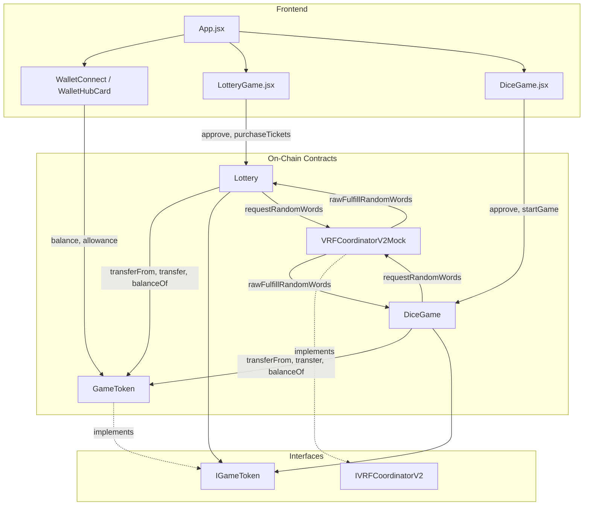

# Architecture

This document describes the system design and component interaction of the On-Chain Verifiable Random Game Platform as implemented in the codebase.

---

## A. System Design

### Overall System Architecture

The platform consists of three layers:

1. **On-chain layer**: Smart contracts deployed on an EVM-compatible network (Hardhat local, Sepolia). Contracts handle game logic, token transfers, and verifiable randomness requests/callbacks.
2. **Off-chain layer**: A mock VRF coordinator (`VRFCoordinatorV2Mock`) for local/testing that simulates Chainlink VRF; in production this would be replaced by Chainlink’s VRF coordinator.
3. **Frontend**: A React (JSX) single-page application that connects via MetaMask (ethers/Web3), loads deployment info from `/deployment-info.json`, and lets users play Lottery and Dice games and view wallet/token state.

### High-Level Module Breakdown

| Component | Location | Role |
|-----------|----------|------|
| GameToken | `contracts/GameToken.sol` | ERC-20 token used for bets and payouts; mint/burn by owner; mint-with-ETH for users. |
| DiceGame | `contracts/DiceGame.sol` | Dice game: user bets tokens, predicts 1–100, VRF roll; payout if roll ≤ prediction with house edge. |
| Lottery | `contracts/Lottery.sol` | Lottery: users buy tickets with tokens; draw when MIN_PLAYERS reached or DRAW_INTERVAL elapsed; VRF picks winner; prize pool minus house edge. |
| VRFCoordinatorV2Mock | `contracts/VRFCoordinatorV2Mock.sol` | Mock VRF: stores request, exposes `fulfillRandomWords` to push random words to game contracts via `rawFulfillRandomWords`. |
| IVRFCoordinatorV2 | `contracts/interfaces/IVRFCoordinatorV2.sol` | Interface for requesting random words and querying fee. |
| IGameToken | `contracts/interfaces/IGameToken.sol` | ERC-20 + mint/burn interface used by game contracts. |

### Contract Responsibilities

- **GameToken**: Holds total supply cap (MAX_SUPPLY), MINT_FEE for mint-with-ETH, owner mint/burn, and ETH withdrawal for collected fees.
- **DiceGame**: Enforces MIN_BET/MAX_BET, receives bet via `transferFrom`, creates a game, requests one random word from VRF, and in the VRF callback computes roll (1–100), payout (including HOUSE_EDGE), and sends tokens to the player (or partial balance if insufficient).
- **Lottery**: Maintains current lottery (start/end time, prize pool, tickets array, winner). Users purchase tickets (tokens transferred to contract); when MIN_PLAYERS or end time is reached, contract requests VRF; callback selects winner by index, applies HOUSE_EDGE to prize, transfers prize to winner, then creates the next lottery.
- **VRFCoordinatorV2Mock**: Assigns request IDs, stores requester; `fulfillRandomWords` generates pseudo-random words and calls `rawFulfillRandomWords(requestId, randomWords)` on the requester.

### Component Interaction Flow

- **Deployment** (`scripts/deploy.js`): Deploys GameToken, VRFCoordinatorV2Mock, Lottery, DiceGame (each game receives VRF and GameToken addresses plus keyHash and subscriptionId). Owner mints tokens to Lottery and DiceGame addresses. Addresses and VRF config are written to `deployment-info.json`.
- **Frontend**: Fetches `deployment-info.json`, wires contract addresses and ABIs into `LotteryGame` and `DiceGame` components. User connects wallet, approves GameToken for the chosen game, then calls `purchaseTickets` or `startGame`. For local testing, an off-chain step (or backend) must call the mock’s `fulfillRandomWords` to complete VRF; the UI can show pending state until then.
- **Cross-contract**: DiceGame and Lottery do not call each other. Both depend on GameToken (transferFrom, transfer, balanceOf) and on the VRF coordinator (requestRandomWords; callback only from coordinator).

---

## B. Component Interaction

### Contract-to-Contract and External Calls

- **DiceGame**
  - User → `startGame(betAmount, prediction)`: DiceGame calls `gameToken.transferFrom(msg.sender, address(this), betAmount)` then `vrfCoordinator.requestRandomWords(...)`.
  - VRF coordinator → `rawFulfillRandomWords(requestId, randomWords)`: DiceGame updates game state (rollResult, isCompleted, payout) then performs `gameToken.transfer(game.player, payout)` (or partial) via low-level call and handles failure by zeroing payout.
- **Lottery**
  - User → `purchaseTickets(ticketCount)`: Lottery calls `gameToken.transferFrom(msg.sender, address(this), totalCost)` and pushes entries to `lottery.tickets`. If MIN_PLAYERS or end time reached, it sets `isActive = false`, `pendingDraw = true`, and calls `vrfCoordinator.requestRandomWords(...)`.
  - VRF coordinator → `rawFulfillRandomWords(requestId, randomWords)`: Lottery sets `isDrawn`, `winningNumber`, `winner`, then `gameToken.transfer(winner, prize)` (with require). Then it clears `pendingDraw` and calls `_createNewLottery()`.
- **GameToken**
  - Owner or user: `mint`, `burn`, `mintWithEth` (payable), `withdrawEth` (owner). `mintWithEth` refunds excess ETH via `payable(msg.sender).transfer(...)`.

### State Transitions for Core Flows

**Dice game**

1. User approves GameToken for DiceGame.
2. User calls `startGame(betAmount, prediction)`: tokens moved to DiceGame, new `Game` created (isCompleted = false), requestId stored, `GameStarted` emitted.
3. Off-chain/backend calls mock’s `fulfillRandomWords(requestId)`.
4. Mock calls DiceGame’s `rawFulfillRandomWords`: game updated (rollResult, isCompleted, payout), then transfer to player; `GameCompleted` emitted.

**Lottery**

1. Users approve GameToken for Lottery and call `purchaseTickets(ticketCount)`: tokens to contract, tickets pushed, prize pool and totalTickets increased, `TicketPurchased` emitted.
2. When `totalTickets >= MIN_PLAYERS` or `block.timestamp >= endTime`, `_requestRandomness` is invoked: lottery deactivated, VRF requested, `LotteryDrawRequested` emitted.
3. Mock calls `rawFulfillRandomWords`: lottery marked drawn, winner index from `randomWords[0] % totalTickets`, prize (minus house edge) transferred to winner, `LotteryDrawn` and `PrizeClaimed` emitted, then `_createNewLottery()` runs.

### Data Flow Summary

- **Tokens**: User → (approve) → GameToken; User → (transferFrom in game) → DiceGame/Lottery; DiceGame/Lottery → (transfer) → User (payout/prize). Owner can withdraw remaining balances from games via `withdrawHouseEdge`.
- **Randomness**: Game contract → `requestRandomWords` → VRF (mock); VRF → `rawFulfillRandomWords` → game contract (single callback per request).

---

## C. Architecture Diagram

The following Mermaid diagram summarizes the implemented components and their interactions.

**Deployment and invocation order**

1. Deploy: GameToken → VRFCoordinatorV2Mock → Lottery (with VRF + GameToken) → DiceGame (with VRF + GameToken).
2. Mint GameToken to Lottery and DiceGame.
3. User flow: connect wallet → load deployment-info → approve tokens → call game (purchaseTickets / startGame) → (off-chain) fulfill VRF for mock → on-chain callback completes game/draw.
